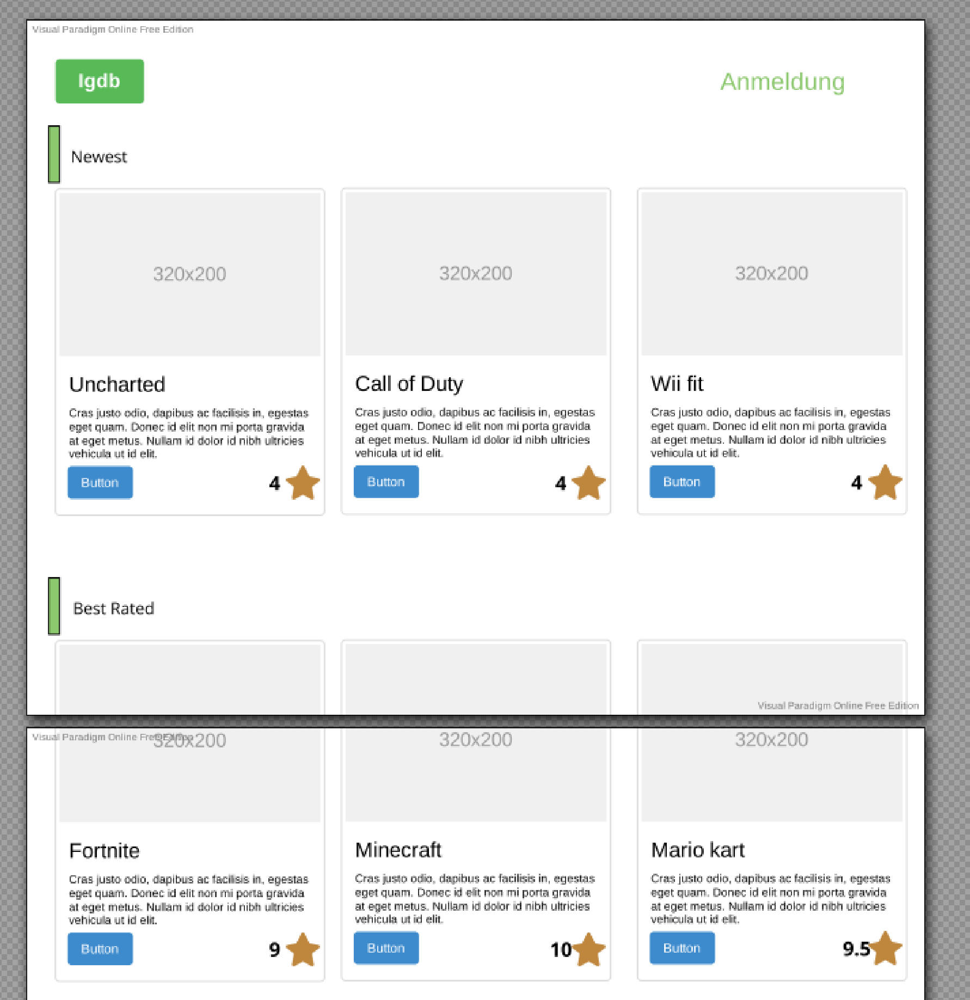

= igdb
:doctype: article
:sectnums:
:toc:

Modul 227

== Klassendiagramm
[plantuml]
-----
@startuml
Class Game{
+id
+Name
+ReleaseDate
+Publisher
+GameDirector
+Downloads
+price
+Crossplay
+platfrom
+Category
+Size
}
Enum category{
+Category
}
class Publisher{
+id
+name
+Employees
+MarketCap
+CEO
}
class Platform{
+id
+Name
+players
}
Game -- category
Game "m" -- "m" Platform
Game "m" -- "1" Publisher
@enduml
-----

== Usecases

.Usecasediagramm von IGDB
[plantuml]
----
class b
----

=== UC-1 Developer
Ich will den Developer von einem Spiel anzeigen lassen.

Ich will alle Games von einem Developer sehen.

==== Sequenz

=== UC-2 Platformen
Ich will von jedem Game die verfügbaren Platformen sehen.

Ich will von jeder Platform alle Games sehen.

== Test Case

path: /
Auf dem Main window ist es so Das wen man auf das I bei einer Katrte drückt sollte Die Tabelle mit den Spezifikation des Objekts Auf kommen. Einfach alle Atribute
Der Knopf Sign in wird dich auf das crud weiter leiten
Path: /crud
Beim crud werden alle Tablen angezeigt die man bearbeiten kann es exestieren auch 3 knöpfe der knopf wo Creat task drauf steht erstellt ein neues window mit einem form das man ein neues item erstellen kann der knopf update macht das selbe einfach das es das bestehende item bearbeitet und der 3 löscht der eintag.

==== Sequenz
path :/crud start up
[plantuml]
----

client -> api: request for all Games
api --> client : api respnds with all api tables in diffrent tables

----
path :/crud add item
[plantuml]
----
client -> api : Add a item to the table
api --> client : respondes with an error or nothing
----

path :/crud update item
[plantuml]
----
client -> api : Update a item to the table
api --> client : respondes with an error or nothing

----
path :/crud delete item

[plantuml]
----
client -> api : delete a item to the table
api --> client : respondes with an error or nothing
----
path :/

[plantuml]
----
@startuml

client -> api: request for all Games
api --> client : api respond with all games

@enduml
----
path :/games{id}

[plantuml]
----
@startuml

client -> api: Request all games
api --> client : api respond withall games

client -> programm  : gives all games
programm -> client : gives backk the game with the right id

@enduml
----
=== Game

Ich will von jedem Game die Spieleranzahl sehen.

Ich will von jedem Game die Bewertung sehen.

=== UI

